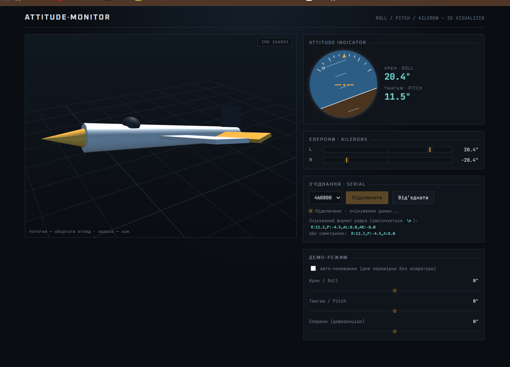

# FlightController

STM32F411 (WeAct BlackPill V2.0) flight controller firmware. PlatformIO +
STM32CubeMX for peripheral config, with a hand-written C++ application layer
on top. Currently reads a CRSF RC receiver over UART1.

## Toolchain

- **PlatformIO** (`platform = ststm32`, `framework = stm32cube`) for
  building/flashing.
- **STM32CubeMX** (`FlightController.ioc`) for clocks/pin/peripheral
  configuration — generates `Core/` and `USB_DEVICE/`.
- **ST-Link** over SWD for flashing/debugging.

## Project layout

| Path | What it is |
|---|---|
| `Core/Src`, `Core/Inc` | CubeMX-generated: `main.c`, clock config, `stm32f4xx_it.c` (interrupt handlers), HAL MSP init. `src_dir`/`include_dir` in `platformio.ini` point here. |
| `USB_DEVICE/` | CubeMX-generated USB CDC (virtual COM port) glue. |
| `App/Inc`, `App/Src` | Hand-written C++ application code — this is where actual firmware logic lives. Compiled via an explicit `build_src_filter`/`build_flags` in `platformio.ini` since it sits outside `Core/`. |
| `boards/blackpill_f411ce.json` | **Required, do not delete.** See below. |
| `tools/cubemx_cleanup.py` | Runs automatically before every build (`extra_scripts` in `platformio.ini`); deletes IDE project scaffolding CubeMX regenerates (`EWARM/`, `Drivers/`, etc.) that PlatformIO doesn't need. |
| `FlightController.ioc` | CubeMX project file. |

## Debugging over UART

The firmware logs attitude data over the USB CDC virtual COM port every
100 ms:

```
R:12.3,P:-4.5,AL:8.0,AR:-8.0
```

(`R` = roll, `P` = pitch, `AL`/`AR` = left/right aileron mix, all in
degrees.)



To watch this data live, connect to the board's COM port with one of:

- `tools/attitude-monitor.html` — open in Chrome/Edge and click
  **Підключити** to connect via the Web Serial API; shows a 3D model,
  artificial horizon, and aileron bars.
- `tools/imu_tilt_view.py COM5` — 2D roll/pitch line plot
  (`pip install pyserial matplotlib`).
- `tools/imu_3d_view.py COM5` — 3D quadcopter attitude view
  (`pip install pyserial matplotlib numpy`).

## Editing peripherals in CubeMX

1. Open `FlightController.ioc` in STM32CubeMX, make changes, **Generate
   Code**.
2. `pio run` — `tools/cubemx_cleanup.py` runs automatically and strips the
   regenerated IDE scaffolding (EWARM/Drivers/etc.) CubeMX writes out.
3. If CubeMX regenerated `Core/Src/main.c` from scratch (new peripherals
   added a fresh `USER CODE` skeleton), re-add the two lines it doesn't
   preserve elsewhere:
   ```c
   /* USER CODE BEGIN 2 */
   app_init();
   /* USER CODE END 2 */
   ...
   while (1) {
     app_loop();
   /* USER CODE END WHILE */
   ```
   (Content inside existing `USER CODE BEGIN/END` markers survives
   regeneration — this is only needed if a section didn't exist before.)

